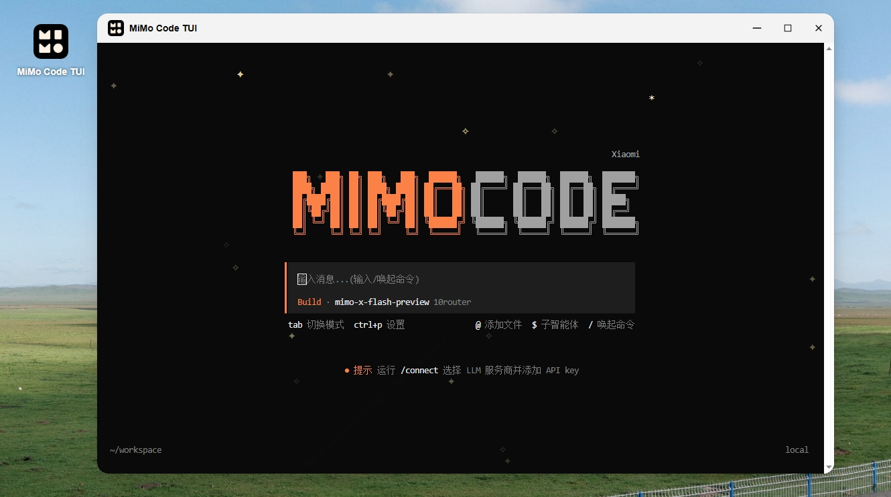

# MiMo Code TUI for fnOS

[](https://github.com/techysy/mimocode-fnos/releases)
[](https://github.com/techysy/mimocode-fnos/releases)
[](LICENSE)
[](https://developer.fnnas.com/docs/guide)
[](https://github.com/XiaomiMiMo/MiMo-Code/releases)

- [English README](./README.en.md)

<p align="center">
  
</p>

把 **小米 MiMo Code** 的官方 TUI 带到飞牛 NAS（fnOS）上，直接在飞牛桌面点开就能用。

> 📦 当前版本：**v0.1.14** — 内置官方 MiMo Code v0.1.14 引擎

| | |
| :--- | :--- |
| **开发者** | [XiaomiMiMo](https://github.com/XiaomiMiMo/MiMo-Code)（小米 MiMo Code 官方） |
| **发布者** | [techysy](https://github.com/techysy/mimocode-fnos)（fnOS 打包适配） |

> 本项目仅为**飞牛 NAS 的打包与适配**，引擎为小米官方原版二进制，未做任何修改。
> 上游项目：<https://github.com/XiaomiMiMo/MiMo-Code>

---

## 📥 下载

**➡️ [前往 GitHub Releases 下载最新版](https://github.com/techysy/mimocode-fnos/releases/latest)**

按你的 NAS 架构选择：

| 架构 | 文件 | 适用设备 |
| :--- | :--- | :--- |
| **x86 / x86_64** | [`mimocode-tui-0.1.14-x86.fpk`](https://github.com/techysy/mimocode-fnos/releases/download/v0.1.14/mimocode-tui-0.1.14-x86.fpk) | 绝大多数飞牛 NAS（Intel / AMD） |
| **ARM / aarch64** | [`mimocode-tui-0.1.14-arm.fpk`](https://github.com/techysy/mimocode-fnos/releases/download/v0.1.14/mimocode-tui-0.1.14-arm.fpk) | ARM 架构设备（如 R5S、树莓派类） |

**不确定用哪个？** 在 NAS 上执行 `uname -m`：

- 输出 `x86_64` → 选 **x86**
- 输出 `aarch64` / `arm64` → 选 **arm**

安装包均已通过 CI 校验（ELF 架构、`platform` 字段、完整性），并附 `SHA256SUMS-{x86,arm}` 校验和。

---

## 作者 / Author

洋芋 (YangYu) · 🐂 [fnOS 应用系列](https://github.com/stars/techysy/lists/fnos-app)

---

## 这是什么

小米 [MiMo Code](https://github.com/XiaomiMiMo/MiMo-Code) 官方仓库的开发重心在 **TUI（终端界面）** 和引擎核心，Web/Desktop 界面已声明不再维护。

本项目把**官方原版 TUI** 打包成飞牛应用：

- **引擎**：小米官方 MiMo Code v0.1.14（未改动的官方二进制）
- **界面**：官方 TUI，通过 [ttyd](https://github.com/tsl0922/ttyd) 包装成网页终端
- **入口**：飞牛桌面图标 / 浏览器访问

**没有重写任何界面**——你看到的就是官方 TUI 本体。

## 特性

| 特性 | 说明 |
| :--- | :--- |
| ✅ 官方原版 TUI | 使用官方 `mimo` 二进制，非重制界面 |
| ✅ 飞牛桌面集成 | 桌面图标一键打开，iframe 内嵌 |
| ✅ 数据隔离 | 独立用户 `mimocode-tui`，数据存于 `/vol4/@appdata/mimocode-tui/` |
| ✅ 可与 Web UI 版共存 | appname 独立，端口 19281，不与其他版本冲突 |
| ✅ 剪贴板修复 | 修复 ttyd 在 iframe 中复制失效的问题 |
| ✅ 品牌化 | 小米 MiMo 图标 + 固定页面标题 |

## 安装

### 方式一：应用中心安装

1. 下载对应架构的 `.fpk`（见上方 [下载](#-下载)）
2. 飞牛 → **应用中心** → 右上角 **手动安装** → 选择 `.fpk` 文件

### 方式二：下载后手动安装

1. 把 `.fpk` 文件上传到 NAS 任意目录
2. 飞牛 → **应用中心** → 右上角 **手动安装** → 选择该 `.fpk`
3. 在安装向导中阅读并勾选同意协议 → 完成安装

安装后从飞牛桌面点击 **MiMo Code TUI** 图标即可。

> ⚠️ 安装需知：应用的 `appname` 为 `mimocode-tui`，与 Web UI 版（`mimocode`）互不冲突，可同时安装。

## 使用

首次进入 TUI 后需要配置模型凭据：

```
# 在 TUI 中按提示配置，或使用
/models
```

工作目录默认为 `/vol4/@appdata/mimocode-tui/workspace`。要指向自己的代码仓库：

```bash
# 编辑启动脚本或设置环境变量
export MIMOCODE_WORKSPACE=/vol1/1000/你的项目
```

## 目录结构

```
mimocode-fnos/
├── manifest              # 飞牛应用清单（版本号跟随官方）
├── VERSION               # 版本号
├── CHANGELOG.md          # 更新日志
├── TROUBLESHOOTING.md    # 问题排查
├── cmd/
│   └── main              # 生命周期脚本（start/stop/status/restart）
├── config/
│   ├── privilege         # 独立运行用户 mimocode-tui
│   └── resource          # 数据卷权限声明
├── wizard/
│   └── install           # 安装时协议授权向导
├── app/
│   ├── bin/              # mimo（官方二进制）+ ttyd（构建时获取）
│   ├── ui/               # 飞牛桌面图标与入口配置
│   └── web/index.html    # 品牌化 ttyd 页面（含剪贴板修复）
├── docs/patches/         # 上游适配补丁
├── scripts/build.sh      # 一键构建
└── ICON.PNG / ICON_256.PNG
```

## 端口与路径

| 项目 | 值 |
| :--- | :--- |
| 端口 | `19281` |
| 数据目录 | `/vol4/@appdata/mimocode-tui/` |
| 工作目录 | `/vol4/@appdata/mimocode-tui/workspace/` |
| 安装目录 | `/vol4/@appcenter/mimocode-tui/` |
| 日志 | `/vol4/@appdata/mimocode-tui/mimocode-tui.log` |

## 自行构建

### 一键构建

```bash
# 从官方源码全量构建（拉源码 → 打补丁 → 装依赖 → 构建引擎 → 下载 ttyd → 打包）
bash scripts/build.sh --from-source

# 已有 app/bin/mimo 时，仅重新打包
bash scripts/build.sh
```

环境变量：

| 变量 | 说明 | 默认 |
| :--- | :--- | :--- |
| `UPSTREAM_VERSION` | 上游 MiMo Code 版本 | 读 `VERSION` 文件 |
| `ARCH` | 目标架构（`x86_64` / `arm64`） | `x86_64` |
| `BUILD_AUTO=1` | 跳过交互确认（CI 用） | 关闭 |
| `WORK` | 源码构建临时目录 | `/tmp/mimocode-build` |

脚本会依次：同步版本号 → 检查/下载依赖 → `fnpack build` → 输出到 `dist/` + 生成 `SHA256SUMS` → 本地环境自动交付到 `/vol1/1000/fnOS App/fpk/mimocode/`（旧包归档 `oldfpk/`）。

### 版本号同步

版本号**单一来源**为 `VERSION` 文件：

```bash
bash scripts/sync-version.sh            # VERSION -> manifest
bash scripts/sync-version.sh 0.1.15     # 指定版本并同步
```

### 手动构建

```bash
# 1. 获取官方源码
git clone --depth 1 --branch v0.1.14 https://github.com/XiaomiMiMo/MiMo-Code.git
cd MiMo-Code

# 2. 应用适配补丁
git apply ../docs/patches/fnos-adaptation.patch

# 3. 安装依赖
bun install --ignore-scripts --backend=copyfile

# 4. 构建引擎
cd packages/opencode
MIMOCODE_CHANNEL=local MIMOCODE_VERSION=local bun run script/build.ts --single --skip-install

# 5. 组装并打包
cp dist/mimocode-linux-x64/bin/mimo <repo>/app/bin/mimo
curl -L -o <repo>/app/bin/ttyd \
  https://github.com/tsl0922/ttyd/releases/download/1.7.7/ttyd.x86_64
chmod +x <repo>/app/bin/*
cd <repo> && fnpack build
```

> 需要 `fnpack` ≥ 1.2.4、`bun` ≥ 1.3.0、`git`

## 自动构建（GitHub Actions）

[`.github/workflows/build.yml`](.github/workflows/build.yml) 自动打包 **x86 与 ARM 双架构**：

| 触发方式 | 行为 |
| :--- | :--- |
| **推送 tag**（如 `v0.1.14`） | 构建 x86 + arm → 校验 → 上传 artifact → **发布 Release** |
| **手动触发**（Actions → Run workflow） | 可选目标架构（all / x86 / arm）与上游版本 |

CI 流程：

1. **矩阵构建**：`x86` 用 `ubuntu-24.04`，`arm` 用原生 `ubuntu-24.04-arm`（避免交叉编译）
2. **安装 fnpack**：从飞牛官方源下载并校验 SHA256
   ```
   https://static2.fnnas.com/fnpack/fnpack-1.2.1-linux-{amd64,arm64}
   ```
3. **构建引擎**：拉官方源码 → 打适配补丁 → `bun install` → 构建对应架构二进制 → 下载对应 ttyd
4. **设置 platform**：动态写入 `manifest` 的 `platform`（x86 / arm）
5. **打包**：清理符号链接后 `fnpack build`
6. **产物校验**（任一失败即中断）：
   - 包结构：`manifest`、`wizard/install`、`LICENSE`
   - 二进制：`bin/mimo`、`bin/ttyd`
   - 生命周期：`cmd/` 下 10 个脚本齐全且 `bash -n` 通过
   - 无硬编码卷路径（`/vol4`）
   - `platform` 字段合法（空值 = manifest 用了错误的 `arch` 字段）
   - ELF 架构匹配（`e_machine` = `0x003e` x86_64 / `0x00b7` arm64）
   - 版本号与 `VERSION` 一致
7. **发布**：Release 已存在则不覆盖（保护手工维护的 notes），仅追加

### 发布新版本

```bash
bash scripts/sync-version.sh 0.1.15   # 更新版本号
git commit -am "release: v0.1.15"
git tag v0.1.15
git push origin master --tags          # CI 自动构建双架构并发 Release
```

### 产物命名

```
mimocode-tui-0.1.15-x86.fpk
mimocode-tui-0.1.15-arm.fpk
SHA256SUMS-x86 / SHA256SUMS-arm
```

## 对上游的改动

本项目仅对官方源码做**最小适配**（见 [`docs/patches/`](docs/patches/)）：

| 文件 | 改动 | 原因 |
| :--- | :--- | :--- |
| `script/build.ts` | 恢复内嵌 Web UI | 上游默认关闭 |
| `script/packages/index.ts` | 放宽 bun 版本约束 | 兼容构建环境 |
| `server/routes/ui.ts` | 放宽 CSP `frame-ancestors` | 支持 iframe 嵌入 |
| `server/middleware.ts` | 静态资源免鉴权 | 页面能正常加载 |
| `app/index.html` | 标题 `OpenCode` → `MiMo Code` | 上游遗留字符串 |

**引擎逻辑本身未做任何修改。**

## 已知问题

- **剪贴板**：已修复 iframe 内复制（多级兜底）；HTTPS 环境下体验最佳
- **HTTP 环境**：浏览器可能限制剪贴板 API，已提供 `execCommand` 兜底
- **仅支持 x86_64**：暂未构建 arm64 版本

## 安装协议授权

安装时会显示**使用协议与授权声明**，需勾选同意才能继续。条款如下：

| 条款 | 内容 |
| :--- | :--- |
| **非官方声明** | 本应用是非官方第三方适配，与小米公司无隶属、赞助或背书关系 |
| **版权归属** | MiMo Code 引擎版权归 Xiaomi Corporation，遵循 MIT 协议 |
| **无担保声明** | 按「现状」提供，不附带任何明示或暗示的担保 |
| **风险自担** | 数据丢失、服务中断、模型费用、密钥泄露等风险自负 |
| **权限说明** | 需访问 NAS 文件系统并以独立用户执行命令 |
| **网络安全** | 默认监听 19281，建议仅在内网使用，勿暴露公网 |
| **开源许可** | MIT 协议发布，保留小米原始版权声明 |

该协议由 [`wizard/install`](wizard/install) 定义，使用 fnOS 安装向导的 `checkbox` 必选类型实现（`required: true`，不勾选则无法安装）。

## ⚠️ 安全须知

本应用在 `19281` 端口提供**完整的 shell 执行能力**，默认绑定 `0.0.0.0`。

- **请勿直接暴露到公网**
- 远程访问请走飞牛 FN Connect 或带认证的反向代理
- 可加访问口令（在 `cmd/main` 中给 ttyd 加 `-c 用户名:密码`）
- 可限制为本机（把 `-i "0.0.0.0"` 改为 `-i "127.0.0.1"`）
- 可设为只读（去掉 `-W` 参数）

详见 [TROUBLESHOOTING.md](TROUBLESHOOTING.md)。

## 免责声明

- 本项目是**非官方的第三方适配**，与小米公司无关
- MiMo Code 版权归 **Xiaomi Corporation** 所有，遵循 MIT 协议
- 引擎二进制为官方原版，未做修改

## License

[MIT](LICENSE) — 保留小米原始版权声明

Copyright (c) 2026 MiMo Code, Xiaomi Corporation
Copyright (c) 2025 opencode
